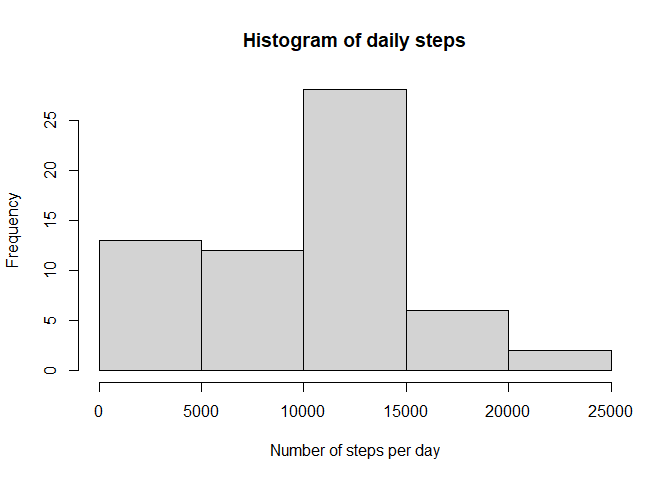
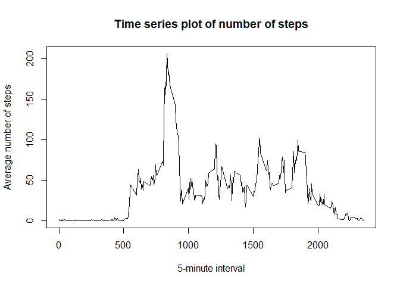
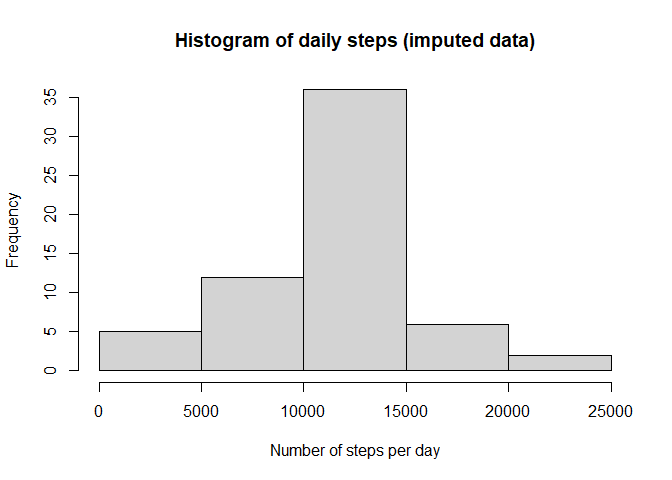
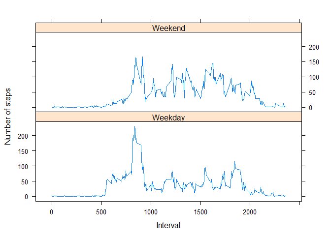

## Introduction

It is now possible to collect a large amount of data about personal movement using activity monitoring devices such as a Fitbit, Nike Fuelband, or Jawbone Up. These type of devices are part of the “quantified self” movement – a group of enthusiasts who take measurements about themselves regularly to improve their health, to find patterns in their behavior, or because they are tech geeks. But these data remain under-utilized both because the raw data are hard to obtain and there is a lack of statistical methods and software for processing and interpreting the data.

This assignment makes use of data from a personal activity monitoring device. This device collects data at 5 minute intervals through out the day. The data consists of two months of data from an anonymous individual collected during the months of October and November, 2012 and include the number of steps taken in 5 minute intervals each day.  

The variables included in this dataset are:  

* steps: Number of steps taking in a 5-minute interval (missing values are coded as NA)
* date: The date on which the measurement was taken in YYYY-MM-DD format
* interval: Identifier for the 5-minute interval in which measurement was taken  
  
The dataset is stored in a comma-separated-value (CSV) file and there are a total of 17,568 observations in this dataset.

## Loading and preprocessing the data
The below code reads in the activity dataset from file and tidies it up for analysis. The first is done using **read.csv()** to read the dataset into a variable named `data`. The second line converts the dates in the 'date' column to from type *character* to type *Date*.

```r
data <- read.csv("activity.csv", header = T)
data[2] <- as.Date(data[[2]])
```


## What is mean total number of steps taken per day?

The following code does three things:  

1. Calculates the total number of steps taken per day.
2. Plots a histogram of the total number of steps taken per day.
3. Calculates and reports the mean and median of the total number of steps taken per day.  

The **tapply()** function calculates the sum of 'steps' by 'date' and puts it into `daily`. The next line plots a histogram of the values of `daily`. The last two lines calculate the mean and median respectively.

```r
daily <- tapply(data$steps, data$date, sum, na.rm = T)
hist(daily, xlab = "Number of steps per day", main = "Histogram of daily steps")
daily_mean <- mean(daily)
daily_median <- median(daily)
```

<!-- -->
  
The mean number of steps taken per day is **9354.23** and the median number of steps taken per day is **10395**.


## What is the average daily activity pattern?

This code chunk makes a time series plot of the 5-minute interval (x-axis) and the average number of steps taken, averaged across all days (y-axis).

```r
mean_int <- tapply(data$steps, data$interval, mean, na.rm = T)
plot(names(mean_int), mean_int, type = "l", main = "Time series plot of number of steps",
     xlab = "5-minute interval", ylab = "Average number of steps")
max_int <- as.integer(names(which.max(mean_int)))
```

<!-- -->
  
Across all the days in the dataset, the maximum number of steps are recorded, on average, in the interval **835 -- 840**.


## Imputing missing values

There are a number of days/intervals where there are missing values (coded as NA). The presence of missing days may introduce bias into some calculations or summaries of the data. The following code rectifies this by counting the total number of NAs and replacing them with the mean value for that 5-minute interval. The code automatically loads the required libraries. The **coalesce()** function replaces all NA values with values from the vector of mean values, while the **mutate()** function creates a new data frame `data_imp` containing these values.

```r
library(plyr)
library(dplyr)
nas <- sum(is.na(data$steps))
mean_vec <- rep_len(mean_int, nrow(data))
data_imp <- mutate(data, steps = coalesce(steps, mean_vec))
```
  
There are **2304 NAs** in the original data frame which are imputed.  

The next code chunk uses this new dataset (with the missing data filled in) and makes a histogram of the total number of steps taken each day. It also calculates and reports the mean and median total number of steps taken per day.  

```r
daily_full <- tapply(data_imp$steps, data_imp$date, sum, na.rm = T)
hist(daily_full, xlab = "Number of steps per day", main = "Histogram of daily steps (imputed data)")
daily_mean_full <- mean(daily_full)
daily_median_full <- median(daily_full)
```

<!-- -->
  
From the filled-in data, we compute that the mean number of steps taken per day is **10766.19** and the median number of steps taken per day is **10766.19**. Notably, these values are larger than those observed from the original dataset.

## Are there differences in activity patterns between weekdays and weekends?

The following code answers this question by plotting these two quantities seperately.  
We create a new factor variable in the dataset with two levels – “Weekday” and “Weekend” indicating whether a given date is a weekday or weekend day. To achieve this, we use the **weekdays()** function which gives the day of the week for each date in the dataset. The **recode()** function replaces the days with the appropriate labels.  

In the next step, **group_by()** groups the data by day and interval, and then the **summarise()** function calculates the desired mean of steps taken in a given interval. This is stored in a vector called `data_mean`. Finally, we use the **xyplot()** function from the **lattice** package to make a panel plot containing a time series plot of the 5-minute interval (x-axis) and the average number of steps taken, averaged across all weekday days or weekend days (y-axis).  

```r
library(lattice)
data_imp$day <- weekdays(data_imp$date)
data_imp <- mutate(data_imp, day = recode(day, "Saturday" = "Weekend", "Sunday" = "Weekend", .default = "Weekday"))
data_mean <- group_by(data_imp, interval, day) %>% summarise(avg_steps = mean(steps))
xyplot(data_mean$avg_steps ~ data_mean$interval | data_mean$day, layout = c(1, 2), type = "l", xlab = "Interval", ylab = "Number of steps")
```

<!-- -->
  
Thus, from this analysis, we obtain an estimate of the type and distribution of the given data and what it could signify for various applications.
